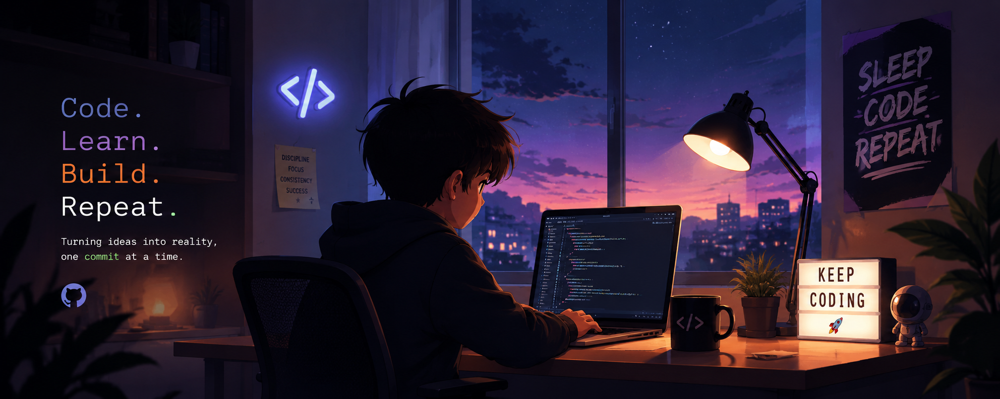

  

<h1 align="center">Hi 👋, I'm Prasad Mahajan</h1>

<h3 align="center">
MCA Student • Full Stack Developer • Machine Learning Enthusiast
</h3>

  

---

# 💫 About Me

🎓 MCA Student at DY Patil Vidyapeeth, Pune  
💻 Passionate about Software Development & Problem Solving  
🚀 Exploring Full Stack Development, AI & Machine Learning  

### 🌱 Currently Learning
- React.js & JavaScript
- Java & Advanced Java
- Node.js & Express
- Machine Learning & AI
- DBMS & MongoDB

### ⚡ Fun Fact
I love turning ideas into real-world projects and continuously improving my coding skills through practice and experimentation.

---

# 🌐 Connect With Me

---

# 💻 Tech Stack

---

# 📊 GitHub Stats

---

# 🏆 GitHub Trophies

---

# ✍️ Random Dev Quote

---

# 👀 Profile Views

---

✨ Thanks for visiting my profile ✨

